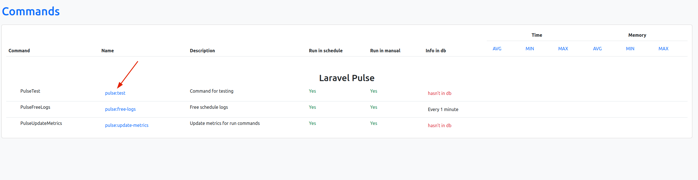
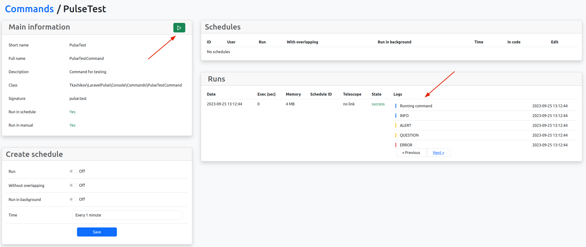
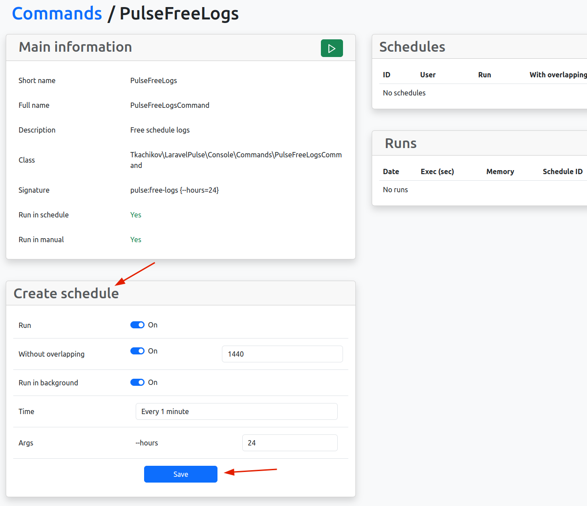
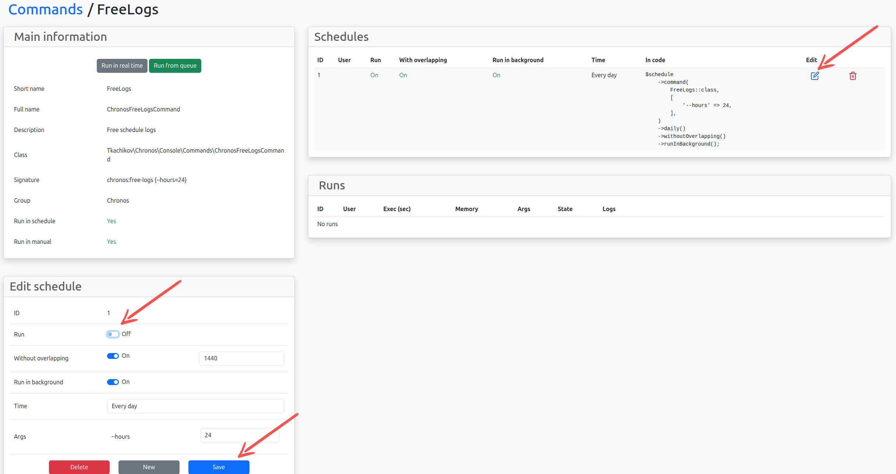

<p align="center">
    
</p>

<p align="center">
  <a href="https://packagist.org/packages/tkachikov/chronos"></a>
  <a href="https://packagist.org/packages/tkachikov/chronos"></a>
  
  
  
  
  <a href="https://opensource.org/licenses/MIT"></a>
</p>

<p align="center">
  <a href="https://github.com/tkachikov/chronos/stargazers"></a>
  <a href="https://github.com/tkachikov/chronos/issues"></a>
  <a href="https://github.com/tkachikov/chronos/commits/main"></a>
</p>

This package for setting commands in schedule.

## Installation

Require this package with composer using the following command
```shell
composer require tkachikov/chronos
```

Run Chronos command for install:
```shell
php artisan chronos:install --migrate
```

Added Chronos scheduler in `app/Console/Kernel.php`:
```php
// ...
use Tkachikov\Chronos\Services\ScheduleService;

// ...
class Kernel extends ConsoleKernel
{
    // ...
    protected function schedule(Schedule $schedule): void
    {
        app(ScheduleService::class)->schedule($schedule);
    }
    // ...
}
```

## Authorization

In defaults pages open for all users and also without auth middleware.

For open setting pages for authenticated users need uncommented 'auth' middleware in config `chronos.php`:
```php
return [
    'domain' => env('CHRONOS_DOMAIN'),

    'middlewares' => [
        'web',
        'auth',
        // 'Tkachikov\Chronos\Http\Middleware\Authorize',
    ],
];
```


For authorization in production uncommented Chronos auth in config `chronos.php` and set statements in `app/Providers/ChronosServiceProvider`:
```php
return [
    'domain' => env('CHRONOS_DOMAIN'),

    'middlewares' => [
        'web',
        'auth',
        'Tkachikov\Chronos\Http\Middleware\Authorize',
    ],
];
```
```php
// ...
class ChronosServiceProvider extends ChronosApplicationServiceProvider
{
    // ...
    protected function gate(): void
    {
        Gate::define('viewChronos', function ($user) {
            return $user->hasRole('admin');
        });
    }
}
```

## Usage

Visit route `/chronos`, example: [localhost:8000/chronos](http://localhost:8000/chronos)

### For testing

Open `chronos:test` command:


Run `chronos:test` command:


### Run attributes

If you need off run command from Chronos dashboard (`notRunInManual`) or schedules (`notRunInSchedule`) set attributes:<br>
For example all off:
```php
// ...
#[notRunInManual]
#[notRunInSchedule]
class TestCommand extends Command
{
    // ...
}
```

### Logging and states

For logging command messages and set status added trait `ChronosRunnerTrait`:
```php
// ...
class TestCommand extends Command
{
    use ChronosRunnerTrait;
    // ...
}
```

### Create schedules

Open your command and set params for it in `Create schedule` and save.


For off command click button edit, check to off `Run` and save:


### Statistics

For calculate statistics run commands you must create schedule for `chronos:update-metrics`

## License

This package is open-sourced software licensed under the [MIT license](https://opensource.org/licenses/MIT).
